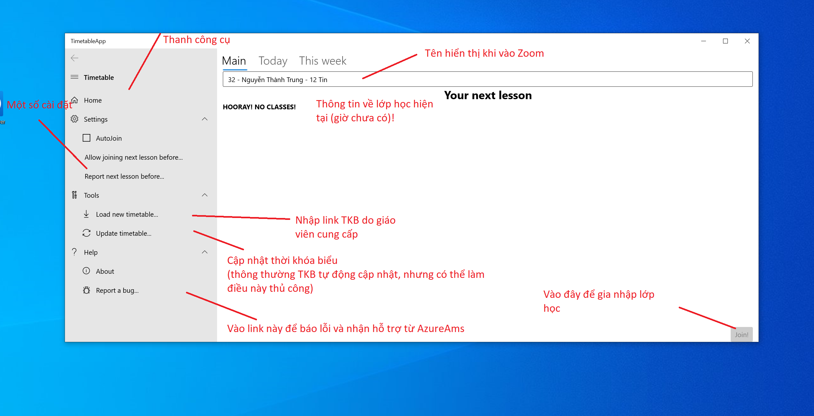
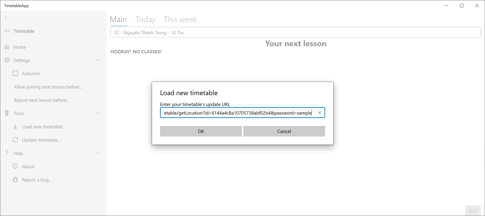
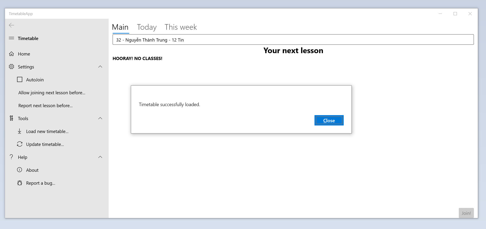
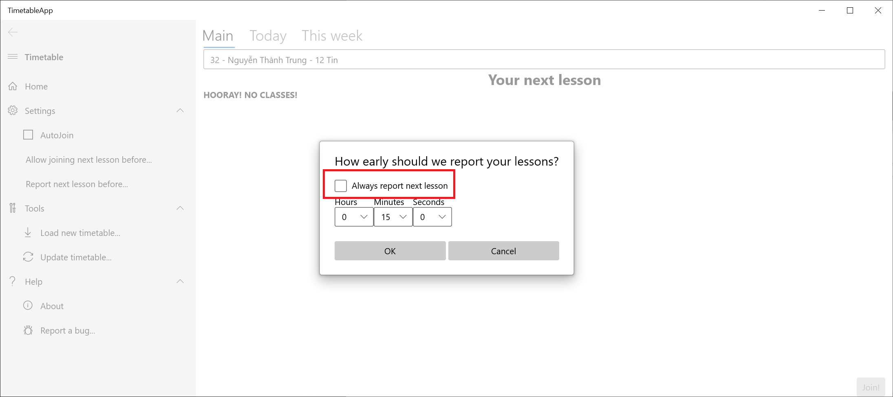
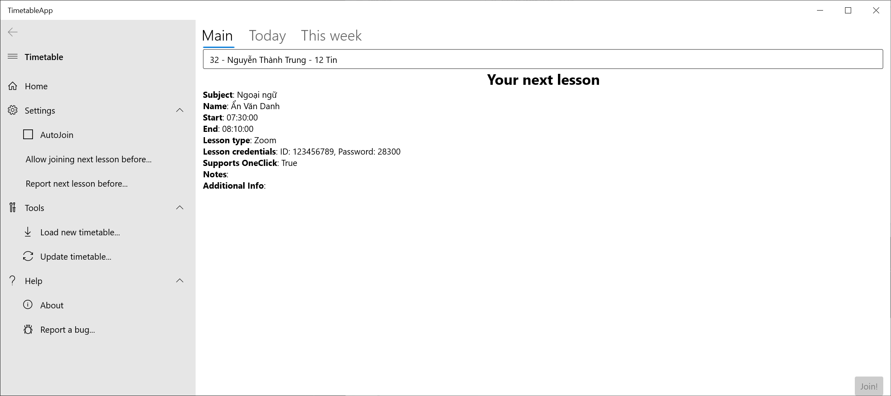
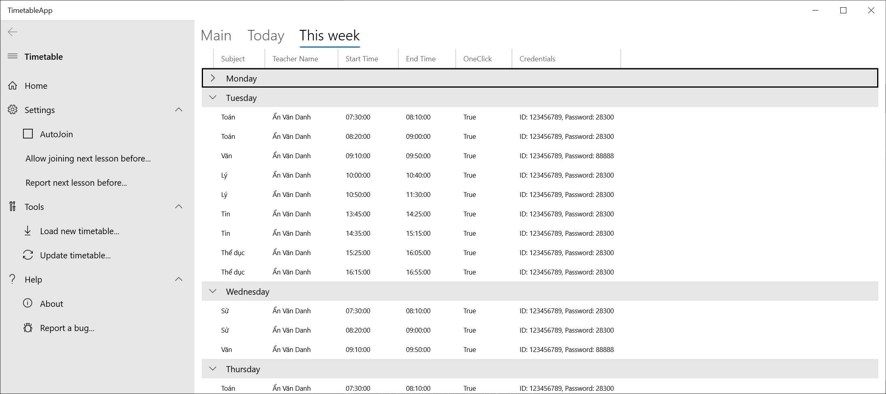
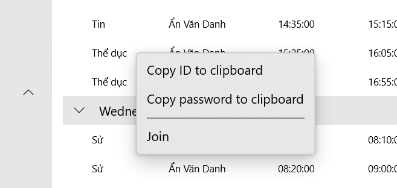

# Hướng dẫn sử dụng TimetableApp - Ứng dụng hỗ trợ thời khóa biểu trực tuyến

TimetableApp là một ứng dụng hỗ trợ cập nhật thời khóa biểu, thông báo giờ học, và tự động vào phòng học trực tuyến, được AzureAms phát triển trong những tháng vừa qua.  

Trong bài viết này, chúng ta sẽ xem qua những tính năng chính của ứng dụng này nhé!

## Giao diện chính của ứng dụng


<p align="center">Tổng quan giao diện chính TimetableApp</p>

Giao diện chính của TimetableApp gồm các phần:

### Thanh công cụ
Gồm các cài đặt và công cụ thiết yếu, bao gồm:
#### Tùy chỉnh (Settings):
- Tự động vào lớp (_AutoJoin_): Chọn nút này để có thể **TỰ ĐỘNG** vào lớp, không cần tương tác với ứng dụng, khi tiết học bắt đầu **TRÊN MỘT SỐ THIẾT BỊ ĐƯỢC HỖ TRỢ**.  
_Lưu ý: Tính năng này bị lỗi, một số lúc có thể không hoạt động, các bạn vẫn nên chú ý thời gian học để vào lớp đúng giờ!_
- Cho phép gia nhập tiết học trước (_Allow joining next lesson before_): Theo mặc định, ứng dụng chỉ cho phép bạn vào lớp trước 5 phút, tránh tình trạng vào nhầm lớp. Bạn có thể thay đổi con số này nếu giáo viên yêu cầu vào sớm hơn để chuẩn bị cho tiết học.
- Thông báo tiết học trước (_Report next lesson before_): Ứng dụng chỉ hiện tiết học hiện tại, hoặc tiết học sắp đến sau 5 phút. Nếu không có tiết trong khoảng thời gian này, ứng dụng sẽ hiện **HOORAY! NO CLASSES!**, tránh trường hợp học sinh  hoảng loạn khi sáng Chủ nhật thấy tiết của ngày Thứ hai xuất hiện trên trang chủ. Để biết thông tin về lớp tiếp theo sớm hơn, bạn có thể thay đổi con số này.

#### Công cụ (Tools)
- Tải TKB mới (_Load new timetable_): Bấm vào đây, để tải TKB mới, bằng cách nhập đường link do giáo viên cung cấp. Mỗi khi ứng dụng bắt đầu, ứng dụng sẽ **tự động** cập nhật TKB theo đường link này.
- Cập nhật TKB (_Update timetable_): Cập nhật TKB một cách thủ công, nếu có thay đổi đột xuất.

#### Hỗ trợ (Help)
- Thông tin (_About_): Hiện ra thông tin tác giả, bản quyền của ứng dụng.
- Báo lỗi (_Report a bug_): Mở đường link GitHub để các bạn báo lỗi của chương trình và nhận hỗ trợ từ AzureAms.

### Màn hình chính
Gồm có 3 phần:
- Tên hiển thị (_Display name_): Tên hiển thị của bạn khi vào lớp.
- Lớp học hiện tại/tiếp theo (_Your current/next lesson_): Thông tin về tiết học hiện tại (tiếp theo, nếu không có tiết nào đang diễn ra).
- Nút Gia nhập lớp (_Join_): Gia nhập tiết học hiện tại/tiếp theo, nếu có.

### Màn hình Hôm nay (_Today_) và Tuần này (_This week_)
Gồm các tiết học trong hôm nay, và trong tuần này, để các bạn dễ dàng nắm rõ lịch học và chuẩn bị bài học đầy đủ.

## Thiết lập ứng dụng
Để sử dụng TimetableApp, bạn cần một đường link do giáo viên hoặc cán bộ lớp cung cấp. Đường link đó dẫn đến một file JSON chứa thông tin, với định dạng được quy định ở trong [tài liệu này](https://github.com/AzureAms/TimetableApp.Uno/blob/master/README.md#data-format).

Để hỗ trợ trải nghiệm, AzureAms đã chuẩn bị một đường link demo:
```
https://azureams-timetableserver.herokuapp.com/api/timetable/getLocation?id=6144a4c8a10705738abf02b4&password=sample
```

Chọn nút _Load new timetable_, một hộp thoại sẽ mở ra. Bạn cần nhập vào đường link thời khóa biểu, rồi bấm OK.



Các bạn hãy đợi một lát, và sẽ có một hộp thoại mở ra:



Nếu hộp thoại báo nội dung này, các bạn đã nhập được TKB đầu tiên!

Hiện tại, lúc mình viết bài này, đang là buổi tối, nên không có tiết học nào diễn ra. Tuy nhiên, mình có thể chính cho thời khóa biểu thông báo tiết học tiếp theo ngay bây giờ. 

Đầu tiên, các bạn chọn _Report next lesson before..._, rồi hộp thoại này sẽ hiện ra:



Đánh dấu vào ô _Always report next lesson_, rồi bấm OK. Tiết học của ngày hôm sau sẽ hiện ra:



Giờ bạn có thể chờ tiết học bắt đầu và bấm _Join_ để tham gia!

Nhưng nhỡ, có một tiết học thay đổi đột xuất, đòi hỏi bạn phải vào Zoom của một giáo viên khác thì sao?  
Phải chăng bạn sẽ spam group lớp để xin link?

**KHÔNG!**

## Mục _Today_ và _This week_

Ngoài thẻ _Main_, ứng dụng còn có 2 thẻ khác: _Today_ và _This week_, với chức năng gần như tương tự nhau.



Ngoài việc cho một cái nhìn tổng quan về thời khóa biểu trong các ngày tiếp theo, các mục này còn có tính năng giúp các bạn gia nhập học các tiết học ngoài giờ.

Giả sử như bạn cần vào học tiết _Thể dục_ của thầy _Danh_ ngay bây giờ, bạn sẽ tìm đến tiết của thầy Danh, và bấm chuột phải:



Một menu sẽ hiện ra. Các bạn chỉ cần chọn _Join_ để vào lớp!

TRẢI NGHIỆM NGAY THỜI KHÓA BIỂU DEMO TRÊN MẠNG [TẠI ĐÂY](https://bit.ly/TimetableAppSample).

## FAQ
- Q: Tải ứng dụng ở đâu?
- A: AzureAms là một CLB mới thành lập, nên chưa có tài khoản Google Play/Microsoft Store/Apple Store. Chúng mình chưa thể đăng tải các ứng dụng như các công ty. Để tải ứng dụng mới nhất, các bạn hãy theo dõi kênh [Releases](https://github.com/AzureAms/TimetableApp.Uno/releases) trên GitHub, hoặc vào mục [Actions](https://github.com/AzureAms/TimetableApp.Uno/actions) để tải các phiên bản thử nghiệm nóng hổi từ team dev. Nếu các bạn mong muốn được nhìn thấy ứng dụng bọn mình xuất hiện trên các cửa hàng, hãy liên hệ và hỗ trợ chúng tôi qua địa chỉ email: azureamsprogrammingclub@gmail.com. (Ngoài ra, còn có đường link [trực tiếp](https://azureams.github.io/TimetableApp.Uno) đến phiên bản web).

- Q: Lấy link cập nhật ở đâu?
- A: Hiện tại, trong một số lớp sử dụng TimetableApp, có một nhóm học sinh duy trì thời khóa biểu. Nếu bạn muốn bắt đầu duy trì TKB cho lớp mình, hãy cân nhắc sử dụng [CaranoParse](https://github.com/trungnt2910/caranoparse), hoặc có thể liên hệ chúng tôi để biết thêm chi tiết.

- Q: Có cộng đồng nào hỗ trợ và bàn luận về TimetableApp không?
- A: Hiện tại không nhé! Nếu có vấn đề gì, các bạn có thể liên hệ `AduMaster#9035` trên Discord, và nếu cộng đồng sử dụng TimetableApp phát triển có lẽ chúng tôi sẽ mở một server Discord cho ứng dụng này.

CHÚC CÁC BẠN MÙA HỌC ONLINE HIỆU QUẢ.